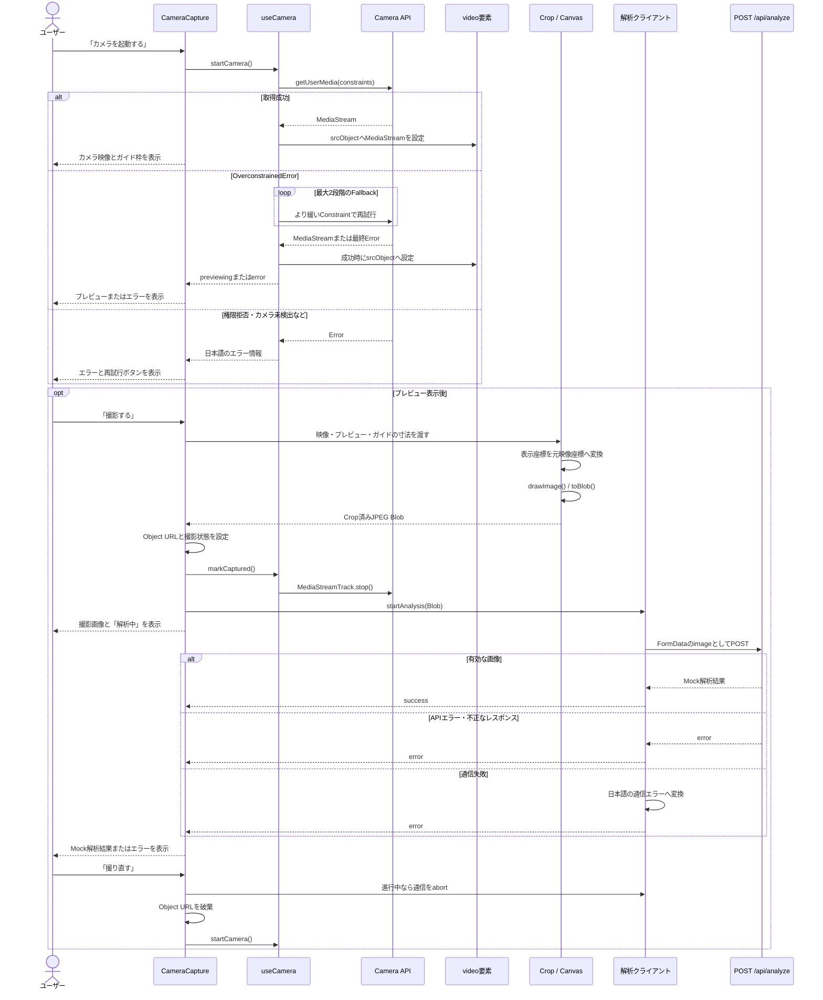

# ID Card Camera Prototype

スマートフォンのブラウザでカメラを起動し、ガイド枠に合わせてカードを撮影するためのプロトタイプです。

背面カメラを優先したプレビュー、ガイド枠に対応する画像の切り抜き、撮影結果の表示、撮り直し、Mock解析までを、Next.jsとブラウザ標準APIを中心に実装しています。

- [公開デモ](https://id-card-camera-prototype-six.vercel.app/)
- [設計ドキュメント](docs/architecture.md)
- [実装計画](docs/implementation-plan.md)

> [!CAUTION]
> このアプリは技術検証用です。実際の免許証、マイナンバーカード、在留カードなどは使用せず、個人情報を含まないダミーカードで確認してください。本人確認や実際の身分証解析は行いません。

## できること

- ユーザー操作を起点にカメラ権限を要求する
- 背面カメラと1920×1080の映像を優先し、利用できない場合は条件を段階的に緩和する
- iPhone Safariを考慮したインラインのカメラプレビューを表示する
- 一般的なカード比率（1.586:1）のガイド枠を表示する
- `object-fit: cover` を考慮して、ガイド枠を元映像上の座標へ変換する
- Canvasでガイド枠部分を切り抜き、JPEG Blobを生成する
- 撮影後にカメラを停止し、切り抜いた画像を表示する
- Blobを同一アプリ内のMock解析APIへ送信する
- 解析中、解析成功、解析失敗を画面に表示する
- 撮り直し時に一時リソースを破棄してカメラを再起動する
- カメラ権限拒否や通信失敗などを日本語で案内する

## 操作方法

1. HTTPSでアプリを開きます。
2. 「カメラを起動する」を押し、ブラウザのカメラ利用を許可します。
3. 白いガイド枠へダミーカードを合わせます。
4. 「撮影する」を押します。
5. ガイド枠に対応する範囲へ切り抜かれた画像とMock解析結果を確認します。
6. 必要に応じて「撮り直す」を押し、もう一度撮影します。

## 処理シーケンス



カメラの状態と解析状態は分離されています。

```text
カメラ: idle → requesting → previewing → captured
                           ↘ error
撮り直し: captured → requesting → previewing

解析: idle → loading → success | error
```

## カメラ機能の仕組み

### 1. カメラを取得する

`useCamera` が `navigator.mediaDevices.getUserMedia()` を呼び出し、取得した `MediaStream` を `<video>` の `srcObject` に設定します。音声は取得しません。

カメラの取得条件は次の順に試します。

1. 背面カメラを優先し、1920×1080を希望する
2. 背面カメラだけを優先する
3. 利用可能な任意のカメラを使う

次の条件へ進むのは `OverconstrainedError` の場合だけです。権限拒否など、条件を緩めても解決しないエラーでは再試行しません。また、`facingMode` と解像度は `ideal` 指定のため、背面カメラや指定解像度の利用を保証するものではありません。

### 2. プレビューとガイド枠を表示する

プレビューには次のvideo要素を使用します。

```tsx
<video autoPlay playsInline muted />
```

`playsInline` は、iPhone Safariで映像をページ内に表示するために重要です。映像は `object-fit: cover` でプレビュー領域全体を埋め、上に1.586:1のガイド枠を重ねます。

### 3. ガイド枠を元映像の座標へ変換する

`object-fit: cover` では、映像と表示領域の縦横比が異なると、映像の一部が画面外にはみ出します。そのため、画面上のガイド枠の座標をそのままCanvasへ渡すことはできません。

`calculateCropArea()` は、表示倍率と中央からはみ出した量を求め、ガイド枠を元映像上の座標へ変換します。

```ts
const scale = Math.max(
  containerWidth / videoWidth,
  containerHeight / videoHeight,
);

const offsetX = (videoWidth * scale - containerWidth) / 2;
const offsetY = (videoHeight * scale - containerHeight) / 2;

const sourceX = (guideX + offsetX) / scale;
const sourceY = (guideY + offsetY) / scale;
```

変換後の範囲は元映像の内側へ収まるように補正されます。この処理はDOMやブラウザAPIに依存しない純粋関数として分離しているため、複数の縦横比をUnit Testで確認できます。

### 4. CanvasでJPEGを生成する

`captureImage()` は画面に表示しないCanvasを生成し、`drawImage()` で元映像のCrop範囲を描画します。その後、`toBlob()` でJPEG Blobへ変換します。

```text
HTMLVideoElement
  → CropArea
  → CanvasRenderingContext2D.drawImage()
  → HTMLCanvasElement.toBlob()
  → image/jpeg Blob
```

Blobは `URL.createObjectURL()` で一時URLへ変換し、撮影結果の `` に表示します。Base64への変換や端末への保存は行いません。

### 5. カメラと一時リソースを片付ける

カメラや一時URLが残らないよう、次のcleanupを行います。

- 撮影完了時にすべての `MediaStreamTrack` を停止する
- カメラ再起動前とコンポーネントのUnmount時にもStreamを停止する
- 古いカメラ取得リクエストが遅れて成功した場合、そのStreamを停止する
- 撮り直し、画像差し替え、Unmount時にObject URLを `revoke` する
- 撮り直し、再解析、Unmount時に進行中の解析リクエストを `AbortController` で中断する

## Mock解析API

撮影直後、JPEG Blobを `FormData` の `image` フィールドへ設定し、`POST /api/analyze` へ送信します。

```text
Captured Blob
  → FormData(image)
  → POST /api/analyze
  → Next.js Route Handler
  → Mock JSON
  → 解析結果UI
```

Route Handlerは次を検証します。

- `image` がFileとして存在すること
- ファイルが空でないこと
- MIME typeが `image/*` であること

有効な画像には固定のMock結果を返します。

```json
{
  "documentType": "identity-card",
  "confidence": 0.98,
  "message": "画像を受け付けました。Mock解析が完了しました。"
}
```

ローカルでAPIだけを確認する場合は、個人情報を含まない画像を指定してください。

```bash
curl -X POST http://localhost:3000/api/analyze \
  -F "image=@./dummy-card.jpg"
```

このAPIは実際の画像内容を解析していません。OCR、外部API呼び出し、DB、画像保存はなく、受け取ったファイルをリクエスト処理後も保持する仕組みはありません。

## App Routerとは？

App Routerは、Next.jsの `app` ディレクトリ内のファイル構成から、画面、共通レイアウト、HTTP APIなどを定義する仕組みです。このリポジトリでは次のように対応しています。

| ファイル | 役割 |
| --- | --- |
| `src/app/layout.tsx` | 全画面共通のHTML、メタデータ、グローバルCSS |
| `src/app/page.tsx` | `/` に対応する画面 |
| `src/app/api/analyze/route.ts` | `POST /api/analyze` を処理するRoute Handler |

App Routerではコンポーネントが標準でServer Componentになります。このリポジトリの `page.tsx` は、サーバー側を基本とする薄い画面の入口です。

一方、カメラ、DOM、React State、Effect、Refはブラウザでしか扱えません。そのため `CameraCapture.tsx` は先頭に `"use client"` を宣言し、Client Componentとして実行します。

```text
Server側
  src/app/layout.tsx
  src/app/page.tsx
  src/app/api/analyze/route.ts

Browser側
  CameraCaptureと配下のUI
  useCamera / useImageAnalysis
  MediaStream / Canvas / Object URL
```

これにより、ページ全体を無条件にクライアント実行へ寄せず、ブラウザ機能が必要な範囲だけを明確にできます。現在のRoute HandlerはMockの受付口であり、実サービス向けのBFFではありません。

## 使用技術

| 技術 | バージョン | 用途 |
| --- | ---: | --- |
| Next.js | 16.3.1 | App Router、Route Handler、開発・ビルド |
| React / React DOM | 19.2.8 | UI、ローカルState、Custom Hook |
| TypeScript | 6.0.3 | `strict: true` による型検査 |
| CSS Modules | Next.js組み込み | コンポーネント単位のスタイル |
| Vitest | 4.1.11 | Unit Test |
| ESLint | 9.39.5 | Next.js・TypeScriptの静的解析 |
| Vercel | - | HTTPS環境へのデプロイ |

主に使用しているブラウザ標準APIは次のとおりです。

- MediaDevices / MediaStream
- Canvas 2D
- Blob / File / FormData
- Fetch / AbortController
- URL / Object URL
- DOM Geometry (`getBoundingClientRect()`)

カメラ、UI、状態管理のための外部ライブラリは追加していません。状態はReactのローカルStateで管理しています。

## ディレクトリ構成

```text
src/
├── app/
│   ├── api/analyze/route.ts      # Mock解析API
│   ├── globals.css               # グローバルスタイル
│   ├── layout.tsx                # ルートレイアウト
│   └── page.tsx                  # / の画面
├── components/camera/
│   ├── CameraCapture.tsx         # 撮影フロー全体の調整
│   ├── CameraPreview.tsx         # videoプレビュー
│   ├── CaptureGuide.tsx          # カードのガイド枠
│   ├── CapturedImage.tsx         # 撮影結果
│   └── AnalysisStatus.tsx        # 解析状態・結果
├── hooks/
│   ├── useCamera.ts              # カメラとMediaStreamの管理
│   └── useImageAnalysis.ts       # 解析リクエストの状態管理
├── lib/
│   ├── analysis/analyzeImage.ts  # FormData送信とレスポンス検証
│   └── camera/                   # Constraint、Crop、Canvas、エラー処理
└── types/                        # カメラ・解析の型
```

同じディレクトリにある `*.test.ts` / `*.test.tsx` が、各ロジックや表示状態を検証します。

## ローカル開発

### 必要なもの

- Node.js 20.9.0以上
- npm
- カメラを搭載した端末、またはカメラを利用できるブラウザ

環境変数は不要です。

### セットアップ

```bash
git clone https://github.com/ysys1195/id-card-camera-prototype.git
cd id-card-camera-prototype
npm ci
npm run dev
```

PCでは通常、[http://localhost:3000](http://localhost:3000) を開きます。ブラウザからカメラの利用確認が表示されたら許可してください。

### iPhoneからローカル開発サーバーを見る場合

同じWi-Fi内で開発サーバーを公開すると、MacのLAN IPから画面自体は確認できます。

```bash
npm run dev -- --hostname 0.0.0.0
```

ただし、iPhoneから `http://<MacのLAN IP>:3000` を開いたページは通常Secure Contextではありません。画面が表示できても、カメラAPIを利用できない場合があります。実カメラの確認には、公開デモ、Vercel Preview、またはHTTPS対応のトンネルを使用してください。

## npm scripts

| コマンド | 内容 |
| --- | --- |
| `npm run dev` | Next.js開発サーバーを起動 |
| `npm run build` | 本番用にビルド |
| `npm run start` | ビルド済みアプリを本番モードで起動 |
| `npm run typecheck` | TypeScriptを `noEmit` で検査 |
| `npm run lint` | ESLintを実行 |
| `npm run test` | Vitestを1回実行 |

## テスト

基本の検証コマンドは次のとおりです。

```bash
npm run typecheck
npm run lint
npm run test
npm run build
```

Unit Testでは主に次を確認しています。

- カメラConstraintと段階的Fallback
- MediaStreamTrackの停止と非同期処理のcleanup
- カメラエラーのユーザー向け情報への変換
- `object-fit: cover` を考慮したCrop座標計算
- Canvas描画、JPEG Blob生成、失敗ケース
- Object URLの生成と破棄
- BlobのFormData送信とAPI・通信エラー処理
- Route Handlerの入力検証とMockレスポンス
- 解析中・成功・失敗の表示

カメラ権限や実映像を含む自動E2Eテストはありません。次の項目は実機で確認します。

- カメラ権限の許可・拒否
- 背面カメラのプレビュー
- ガイド枠とCrop結果のずれ
- 撮影後と画面離脱時のカメラ停止
- 撮り直し
- オフラインまたはAPI通信失敗時の表示

## エラーハンドリング

カメラAPIの例外をそのまま画面へ出さず、次の状態をユーザー向けの日本語へ変換します。

- ブラウザがカメラAPIに非対応
- カメラ権限が拒否された
- カメラが見つからない
- 他のアプリなどがカメラを使用している
- 指定したConstraintを満たせない
- その他の起動・撮影エラー

APIへ到達できない場合は、次のメッセージを表示します。

```text
画像の解析に失敗しました。通信環境を確認して、もう一度お試しください。
```

## 現在の対象外

- OCR、顔認識、本人確認
- 実際の身分証解析API
- カード検出、傾き検出、ブレ検出、撮影品質判定
- Goバックエンドや外部APIとの連携
- 画像の永続保存、データベース、ストレージへのアップロード
- 認証
- PWA
- User Agentによる特定端末向けの分岐

`docs/architecture.md` と `docs/implementation-plan.md` は初期MVPを基準にしており、Mock解析を将来拡張として記載しています。現在の実装では、そのうちFormData送信、Route Handler、Mockレスポンス、解析結果UIまでが追加済みです。

## 関連ドキュメント

- [Architecture](docs/architecture.md): コンポーネント責務、Crop計算、カメラライフサイクルなどの設計
- [Implementation Plan](docs/implementation-plan.md): 初期MVPの実装順序と完了条件
- [AGENTS.md](AGENTS.md): このリポジトリでの開発ルールと検証方針
